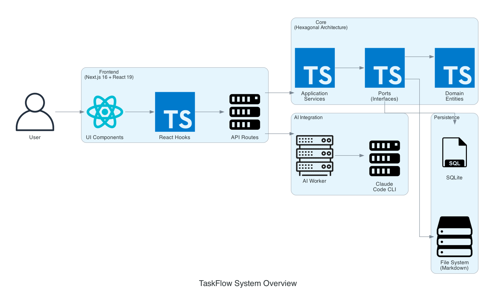
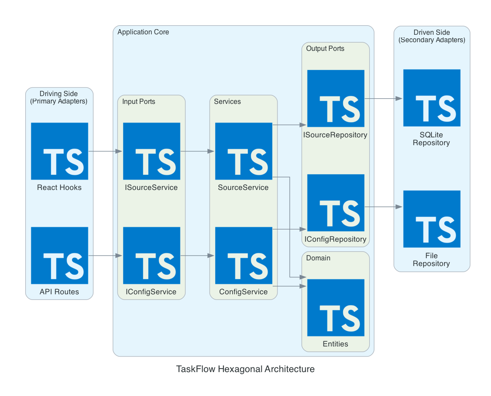
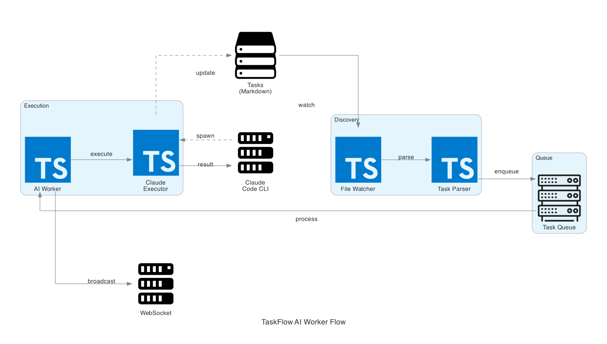
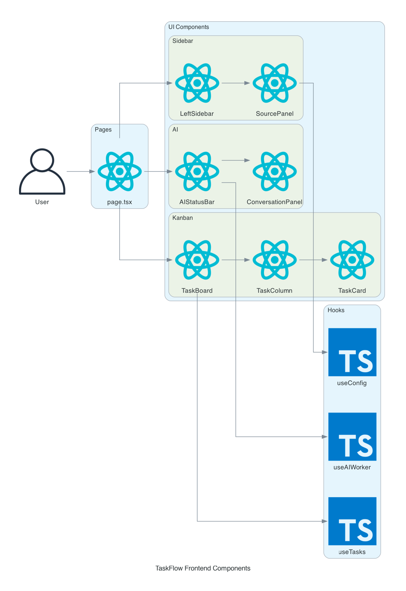
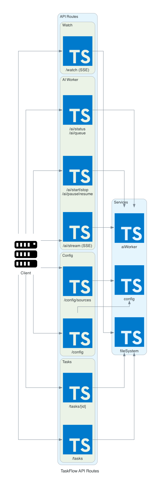

# TaskFlow Architecture Diagrams

> Generated: 2026-01-13
> Tool: diagram_mcp (Python Diagrams library)

## Diagrams

### 1. System Overview


**설명**: TaskFlow 전체 시스템 구성도
- Frontend: Next.js 16 + React 19
- Core: Hexagonal Architecture 기반
- Persistence: File System (Markdown) + SQLite
- AI Integration: Claude Code CLI 연동

---

### 2. Hexagonal Architecture


**설명**: Clean Architecture (Hexagonal) 구조
- **Driving Adapters**: API Routes, React Hooks
- **Application Core**: Services, Domain Entities, Ports
- **Driven Adapters**: File Repository, SQLite Repository

---

### 3. AI Worker Flow


**설명**: AI Worker 작업 처리 흐름
1. File Watcher가 Markdown 파일 변경 감지
2. Task Parser가 태스크 파싱 (gray-matter)
3. 적격 태스크 (assignee: ai-agent, status: TODO) 큐에 추가
4. AI Worker가 큐에서 태스크 꺼내 실행
5. Claude Executor가 Claude Code CLI 호출
6. 결과를 Markdown 파일에 업데이트
7. WebSocket으로 실시간 브로드캐스트

---

### 4. Frontend Components


**설명**: React 컴포넌트 구조
- **Kanban Board**: TaskBoard, TaskColumn, TaskCard, TaskSidebar
- **AI Panel**: AIStatusBar, ConversationPanel
- **Sidebar**: LeftSidebar, SourcePanel
- **Hooks**: useTasks, useConfig, useAIWorker, useTaskFilter

---

### 5. API Routes


**설명**: Next.js API 라우트 구조
- `/api/tasks/*`: 태스크 CRUD
- `/api/config/*`: 설정 관리
- `/api/ai/*`: AI Worker 제어 (start, stop, pause, resume, status)
- `/api/watch`: 파일 변경 SSE 스트림

---

## 기술 스택

| 레이어 | 기술 |
|--------|------|
| Frontend | Next.js 16, React 19, TailwindCSS 4 |
| State | React Hooks, SSE (Server-Sent Events) |
| Persistence | File System (Markdown), SQLite (better-sqlite3) |
| AI | Claude Code CLI |
| DnD | @dnd-kit/core, @dnd-kit/sortable |
| Parser | gray-matter (Markdown frontmatter) |
| Watcher | chokidar |

## 디렉토리 구조

```
frontend/
├── app/                    # Next.js App Router
│   ├── api/               # API Routes
│   └── page.tsx           # Main page
├── components/            # React Components
│   ├── kanban/           # Kanban board
│   ├── ai/               # AI integration
│   ├── sidebar/          # Navigation
│   └── ui/               # Common UI
├── core/                  # Hexagonal Core
│   ├── domain/           # Entities
│   ├── ports/            # Interfaces
│   └── application/      # Services
├── adapters/             # Infrastructure
│   └── persistence/      # Repositories
├── hooks/                # React Hooks
├── lib/                  # Utilities
└── infrastructure/       # DI Container
```
