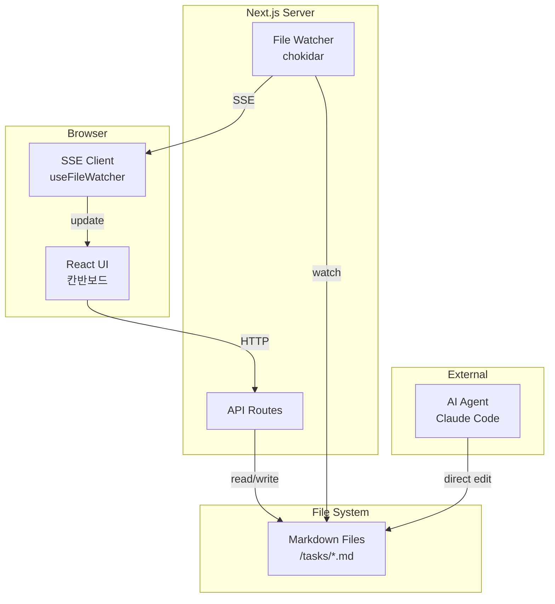
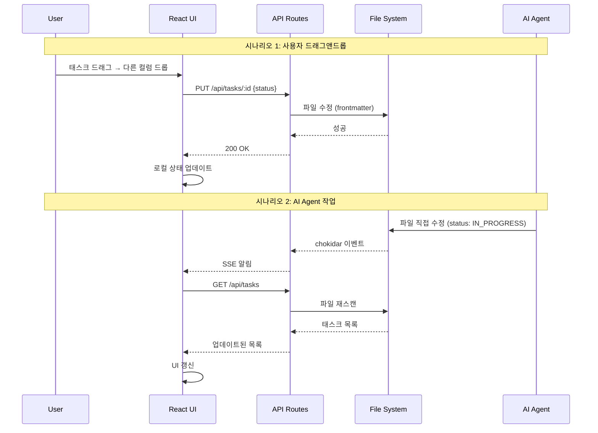
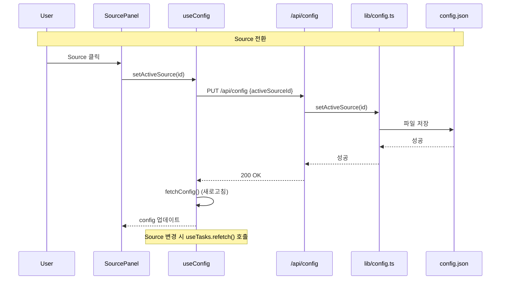

# Design Document

## TaskFlow - 파일 기반 AI 태스크 관리 시스템

---

**Version:** 1.1
**Last Updated:** 2026-01-11
**Status:** In Progress

---

## Overview

TaskFlow는 로컬 마크다운 파일을 기반으로 하는 칸반보드 태스크 관리 시스템입니다. 웹 UI는 파일 시스템을 실시간으로 모니터링하여 변경사항을 반영하고, AI Agent는 파일을 직접 수정하여 자동으로 작업을 수행합니다.

### 핵심 설계 원칙

1. **File as Source of Truth**: 마크다운 파일이 태스크의 유일한 진실 소스
2. **Real-time Sync**: 파일 변경 → UI 자동 업데이트
3. **Bidirectional Edit**: UI ↔ 파일 양방향 수정
4. **AI Agent Compatible**: 파일 직접 접근으로 AI Agent 연동 용이

---

## Steering Document Alignment

### Technical Standards (tech.md)

- **Framework**: Next.js 14+ (App Router)
- **Language**: TypeScript strict mode
- **Styling**: Tailwind CSS (기존 olly-molly 스타일 활용)
- **State Management**: React hooks + 커스텀 훅
- **File Operations**: Node.js fs/promises
- **Watch**: chokidar (Node.js file watcher)

### Project Structure (structure.md)

```
taskflow/
├── app/
│   ├── page.tsx                    # 메인 칸반보드 페이지
│   ├── layout.tsx                  # 루트 레이아웃
│   └── api/
│       ├── tasks/
│       │   ├── route.ts            # GET (목록), POST (생성)
│       │   └── [id]/route.ts       # GET, PUT, DELETE
│       └── watch/
│           └── route.ts            # SSE 파일 변경 알림
├── components/
│   ├── kanban/                     # 칸반보드 컴포넌트
│   │   ├── TaskBoard.tsx
│   │   ├── TaskColumn.tsx
│   │   ├── TaskCard.tsx
│   │   └── TaskSidebar.tsx
│   └── ui/                         # 공통 UI (olly-molly 활용)
├── lib/
│   ├── taskParser.ts               # Frontmatter 파싱
│   ├── fileSystem.ts               # 파일 읽기/쓰기
│   └── fileWatcher.ts              # 파일 감시 로직
├── hooks/
│   ├── useTasks.ts                 # 태스크 상태 관리
│   ├── useFileWatcher.ts           # SSE 연결 훅
│   └── useConfig.ts                # Source 설정 관리 훅
├── types/
│   ├── task.ts                     # 태스크 타입 정의
│   └── config.ts                   # Config 타입 정의
├── .taskflow.config.json           # 앱 설정 파일 (동적 생성)
└── tasks/                          # 기본 태스크 폴더 (configurable)
    └── *.md
```

---

## Code Reuse Analysis

### Existing Components to Leverage

| Component | Source | Usage |
|-----------|--------|-------|
| **KanbanBoard** | `olly-molly/components/kanban/KanbanBoard.tsx` | DnD 컨텍스트, 컬럼 레이아웃 패턴 참조 |
| **KanbanColumn** | `olly-molly/components/kanban/KanbanColumn.tsx` | 드롭 가능한 컬럼 구조 참조 |
| **TicketCard** | `olly-molly/components/kanban/TicketCard.tsx` | 카드 UI, 우선순위 배지 패턴 참조 |
| **TicketSidebar** | `olly-molly/components/kanban/TicketSidebar.tsx` | 상세/편집 사이드바 패턴 참조 |
| **UI Components** | `olly-molly/components/ui/*` | Button, Input, Modal, Badge 등 재사용 |
| **ThemeProvider** | `olly-molly/components/ThemeProvider.tsx` | 다크모드 지원 |

### Integration Points

| System | Integration Method |
|--------|-------------------|
| **File System** | Node.js fs/promises (API Routes) |
| **Real-time Updates** | SSE (Server-Sent Events) |
| **Markdown Parsing** | gray-matter 라이브러리 |
| **AI Agent** | 파일 직접 접근 (외부 프로세스) |

---

## Architecture

### High-Level Architecture



### Data Flow



### Modular Design Principles

- **Single File Responsibility**:
  - `taskParser.ts`: frontmatter 파싱만 담당
  - `fileSystem.ts`: 파일 I/O만 담당
  - `fileWatcher.ts`: 파일 감시만 담당

- **Component Isolation**:
  - `TaskBoard`: 전체 보드 레이아웃 + DnD 컨텍스트
  - `TaskColumn`: 개별 컬럼 (드롭 타겟)
  - `TaskCard`: 개별 카드 (드래그 소스)
  - `TaskSidebar`: 상세/편집 패널

- **Service Layer Separation**:
  - API Routes: HTTP 요청 처리
  - lib/*: 비즈니스 로직
  - hooks/*: 클라이언트 상태 관리

---

## Components and Interfaces

### Component 1: TaskBoard

- **Purpose**: 메인 칸반보드 컨테이너, DnD 컨텍스트 제공
- **Interfaces**:
  ```typescript
  interface TaskBoardProps {
    tasks: Task[];
    onTaskUpdate: (id: string, data: Partial<Task>) => Promise<void>;
    onTaskCreate: (data: Partial<Task>) => Promise<void>;
    onTaskDelete: (id: string) => Promise<void>;
    onTaskSelect: (task: Task | null) => void;
    selectedTask: Task | null;
  }
  ```
- **Dependencies**: @dnd-kit/core, @dnd-kit/sortable, TaskColumn, TaskCard
- **Reuses**: olly-molly KanbanBoard 패턴

### Component 2: TaskColumn

- **Purpose**: 상태별 컬럼, 드롭 타겟
- **Interfaces**:
  ```typescript
  interface TaskColumnProps {
    id: TaskStatus;
    title: string;
    icon: string;
    color: string;
    tasks: Task[];
    onTaskClick: (task: Task) => void;
  }
  ```
- **Dependencies**: @dnd-kit/sortable, SortableContext
- **Reuses**: olly-molly KanbanColumn

### Component 3: TaskCard

- **Purpose**: 개별 태스크 카드, 드래그 소스
- **Interfaces**:
  ```typescript
  interface TaskCardProps {
    task: Task;
    onClick: () => void;
    isDragging?: boolean;
    isAiWorking?: boolean;
  }
  ```
- **Dependencies**: PriorityBadge, useSortable
- **Reuses**: olly-molly TicketCard

### Component 4: TaskSidebar

- **Purpose**: 태스크 상세 보기 및 편집
- **Interfaces**:
  ```typescript
  interface TaskSidebarProps {
    task: Task | null;
    onClose: () => void;
    onSave: (id: string, data: Partial<Task>) => Promise<void>;
    onDelete: (id: string) => Promise<void>;
    onRunAi?: (task: Task) => Promise<void>;
  }
  ```
- **Dependencies**: Input, Textarea, Select, Button
- **Reuses**: olly-molly TicketSidebar

### Component 5: FileWatcher (Server-side)

- **Purpose**: 파일 시스템 변경 감지 및 SSE 브로드캐스트
- **Interfaces**:
  ```typescript
  interface FileWatcher {
    start(directory: string): void;
    stop(): void;
    subscribe(callback: (event: FileEvent) => void): () => void;
  }

  interface FileEvent {
    type: 'add' | 'change' | 'unlink';
    path: string;
    timestamp: number;
  }
  ```
- **Dependencies**: chokidar
- **Reuses**: N/A (신규)

---

## Source Management Feature

### Overview

사용자가 여러 태스크 디렉토리(Source)를 설정하고 전환할 수 있는 기능입니다.

### Architecture

```mermaid
graph TB
    subgraph "UI Layer"
        LS[LeftSidebar<br/>접기/펼치기]
        SP[SourcePanel<br/>Source 관리 UI]
    end

    subgraph "State Layer"
        UC[useConfig Hook<br/>Config 상태]
    end

    subgraph "API Layer"
        CA[/api/config<br/>GET/PUT]
        SA[/api/config/sources/:id<br/>PUT/DELETE]
    end

    subgraph "Service Layer"
        CL[lib/config.ts<br/>Config CRUD]
    end

    subgraph "Storage"
        CF[.taskflow.config.json]
    end

    LS --> SP
    SP --> UC
    UC --> CA
    UC --> SA
    CA --> CL
    SA --> CL
    CL --> CF
```

### Components

#### LeftSidebar

- **Purpose**: 왼쪽 설정 사이드바 컨테이너
- **Features**: 접기/펼치기, 탭 네비게이션 (Sources, Settings)
- **State**: collapsed (boolean)

#### SourcePanel

- **Purpose**: Source 관리 UI
- **Features**:
  - Source 목록 표시 (이름, 경로, 태스크 수)
  - 활성 Source 표시 (녹색 테두리)
  - 새 Source 추가 폼
  - Source 삭제 버튼

### Data Flow



### Config Data Model

```typescript
// types/config.ts

export interface SourceConfig {
  id: string;              // source-{timestamp}
  name: string;            // 사용자 지정 이름
  path: string;            // 절대 경로
  isActive: boolean;       // 활성 상태
  createdAt: string;       // ISO date
  lastAccessed?: string;   // 마지막 접근 시간
}

export interface AppConfig {
  sources: SourceConfig[];
  activeSourceId: string | null;
  theme: 'dark' | 'light';
  sidebarCollapsed: boolean;
}

export interface AddSourceRequest {
  name: string;
  path: string;
}

export interface SourceValidationResult {
  valid: boolean;
  path: string;
  exists: boolean;
  isDirectory: boolean;
  taskCount: number;
  error?: string;
}
```

### Config File Structure

```json
// .taskflow.config.json
{
  "sources": [
    {
      "id": "source-1234567890",
      "name": "Main Tasks",
      "path": "/Users/user/project/tasks",
      "isActive": true,
      "createdAt": "2026-01-11T00:00:00.000Z",
      "lastAccessed": "2026-01-11T09:00:00.000Z"
    }
  ],
  "activeSourceId": "source-1234567890",
  "theme": "dark",
  "sidebarCollapsed": false
}
```

### Key Implementation Details

1. **캐싱 없음**: `lib/config.ts`는 항상 파일에서 직접 읽어 최신 상태 보장
2. **동적 경로**: `getTasksDirectoryAsync()`로 모든 API에서 활성 Source 경로 사용
3. **Source 전환 시**: useTasks.refetch() 호출하여 새 Source의 태스크 로드
4. **기본 Source**: config 파일 없을 시 `tasks/` 폴더 사용

---

## Data Models

### Task Model

```typescript
// types/task.ts

export type TaskStatus =
  | 'TODO'
  | 'IN_PROGRESS'
  | 'IN_REVIEW'
  | 'NEED_FIX'
  | 'COMPLETE'
  | 'ON_HOLD';

export type TaskPriority =
  | 'LOW'
  | 'MEDIUM'
  | 'HIGH'
  | 'URGENT';

export type TaskAssignee =
  | 'ai-agent'
  | 'user'
  | string;

export interface Task {
  // Frontmatter fields
  id: string;
  title: string;
  status: TaskStatus;
  priority: TaskPriority;
  assignee: TaskAssignee;
  created_at: string;      // ISO date string
  updated_at: string;      // ISO date string
  tags: string[];

  // Content fields
  description: string;     // ## Description 섹션
  requirements: string;    // ## Requirements 섹션
  feedback: string;        // ## Feedback 섹션
  aiWorkLog: string;       // ## AI Work Log 섹션

  // Metadata
  filePath: string;        // 실제 파일 경로
  rawContent: string;      // 원본 마크다운 내용
}
```

### Markdown File Structure

```yaml
---
id: task-001
title: 사용자 인증 API 구현
status: TODO
priority: HIGH
assignee: ai-agent
created_at: 2025-01-11
updated_at: 2025-01-11
tags: [backend, auth, api]
---

## Description

태스크 상세 설명...

## Requirements

- 요구사항 1
- 요구사항 2

## Feedback

(사용자 피드백 - NEED_FIX 시 AI가 참조)

## AI Work Log

(AI Agent가 작업 결과 기록)
```

### API Response Models

```typescript
// types/api.ts

export interface TaskListResponse {
  tasks: Task[];
  total: number;
  directory: string;
}

export interface TaskDetailResponse {
  task: Task;
}

export interface TaskUpdateRequest {
  title?: string;
  status?: TaskStatus;
  priority?: TaskPriority;
  assignee?: TaskAssignee;
  tags?: string[];
  description?: string;
  requirements?: string;
  feedback?: string;
}

export interface FileWatchEvent {
  type: 'add' | 'change' | 'unlink';
  taskId: string;
  timestamp: number;
}
```

---

## Error Handling

### Error Scenarios

| # | Scenario | Handling | User Impact |
|---|----------|----------|-------------|
| 1 | 파일 파싱 실패 (잘못된 frontmatter) | 에러 로그 기록, 해당 파일 스킵 | 해당 태스크 미표시, 에러 알림 |
| 2 | 파일 쓰기 실패 (권한 없음) | 자동 재시도 3회, 실패 시 에러 표시 | 저장 실패 메시지, 재시도 버튼 |
| 3 | 파일 감시 오류 | 폴백 모드 (폴링), 에러 알림 | 수동 새로고침 버튼 표시 |
| 4 | 동시 수정 충돌 | 파일 타임스탬프 비교, 충돌 감지 | 충돌 알림, 덮어쓰기/취소 선택 |
| 5 | Claude Code CLI 미설치 | 설치 확인 API, 안내 모달 | 설치 가이드 표시 |

### Error Response Format

```typescript
interface ApiError {
  error: {
    code: string;
    message: string;
    details?: Record<string, unknown>;
  };
}

// Example error codes
const ERROR_CODES = {
  PARSE_ERROR: 'TASK_PARSE_ERROR',
  FILE_NOT_FOUND: 'FILE_NOT_FOUND',
  WRITE_FAILED: 'FILE_WRITE_FAILED',
  CONFLICT: 'CONCURRENT_MODIFICATION',
  INVALID_STATUS: 'INVALID_TASK_STATUS',
};
```

---

## Testing Strategy

### Unit Testing

**Framework**: Jest + React Testing Library

**Key Components to Test**:

| Component/Module | Test Focus |
|------------------|------------|
| `taskParser.ts` | Frontmatter 파싱 정확성, 에러 핸들링 |
| `fileSystem.ts` | 파일 읽기/쓰기, 경로 검증 |
| `TaskCard` | 렌더링, 클릭 이벤트, 상태 표시 |
| `TaskColumn` | 드롭 영역, 태스크 필터링 |
| `PriorityBadge` | 우선순위별 색상/텍스트 |

**Example Test Cases**:
```typescript
// taskParser.test.ts
describe('parseTaskFile', () => {
  it('should parse valid frontmatter correctly', () => {});
  it('should throw on invalid frontmatter', () => {});
  it('should extract markdown sections correctly', () => {});
  it('should handle missing optional fields', () => {});
});
```

### Integration Testing

**Framework**: Jest + supertest

**Key Flows to Test**:

| API Endpoint | Test Cases |
|--------------|------------|
| `GET /api/tasks` | 전체 목록 조회, 빈 폴더 처리 |
| `GET /api/tasks/:id` | 존재하는 태스크, 404 처리 |
| `PUT /api/tasks/:id` | 상태 변경, 유효성 검사 |
| `POST /api/tasks` | 태스크 생성, ID 자동 생성 |
| `DELETE /api/tasks/:id` | 파일 삭제, 404 처리 |

### End-to-End Testing

**Framework**: Playwright

**User Scenarios to Test**:

1. **태스크 드래그앤드롭 상태 변경**
   - TODO → IN_PROGRESS 드래그
   - 파일 frontmatter 업데이트 확인

2. **태스크 상세 편집**
   - 카드 클릭 → 사이드바 열림
   - 필드 수정 → 저장
   - 파일 내용 변경 확인

3. **실시간 동기화**
   - 외부에서 파일 수정
   - UI 자동 업데이트 확인

4. **새 태스크 생성**
   - 생성 버튼 클릭
   - 폼 작성 → 저장
   - 칸반보드에 표시 확인

---

## Performance Considerations

### Optimization Strategies

| Area | Strategy | Target |
|------|----------|--------|
| 초기 로드 | 파일 병렬 읽기 (`Promise.all`) | < 1s (100 files) |
| 파일 감시 | chokidar persistent mode + debounce | < 500ms 반응 |
| UI 렌더링 | React.memo + useMemo | 60fps 드래그 |
| SSE | 단일 연결 재사용 | 연결 오버헤드 최소화 |

### Debounce Strategy

```typescript
// 파일 변경 이벤트 debounce (100ms)
const debouncedFileChange = debounce((path: string) => {
  broadcastChange(path);
}, 100);
```

---

## Security Considerations

| Concern | Mitigation |
|---------|------------|
| Path Traversal | 경로 정규화 + 화이트리스트 폴더만 허용 |
| XSS | 마크다운 sanitize (DOMPurify) |
| File Injection | 파일명 검증 (alphanumeric + hyphen만) |

---

## Change Log

| Version | Date | Author | Changes |
|---------|------|--------|---------|
| 1.0 | 2025-01-11 | Claude | Initial design from PRD |
| 1.1 | 2026-01-11 | Claude | Source Management Feature 섹션 추가, 프로젝트 구조 업데이트 |
