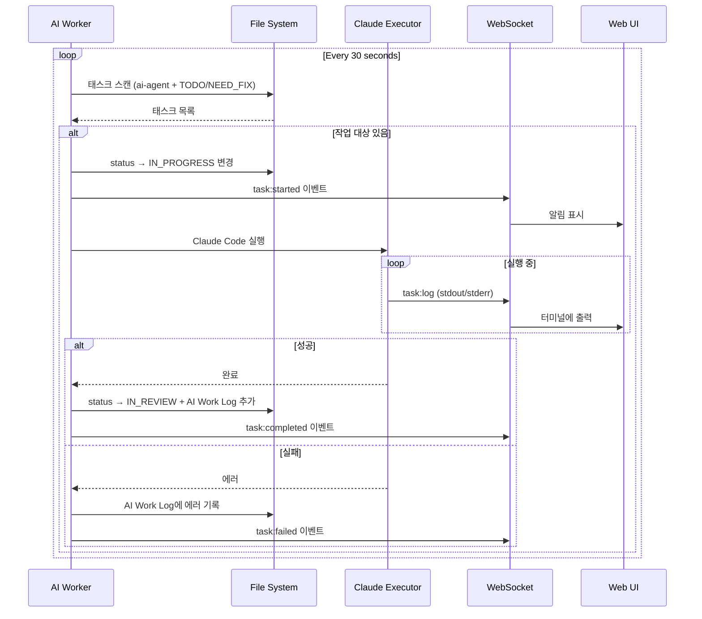

# Tasks Document

## TaskFlow - 파일 기반 AI 태스크 관리 시스템

---

**Version:** 1.1
**Last Updated:** 2026-01-11
**Status:** In Progress
**Estimated Total Effort:** 2 weeks (MVP)

---

## Phase 1: 프로젝트 셋업 및 핵심 타입 (Day 1-2) ✅ COMPLETED

---

- [x] 1.1 프로젝트 초기화 및 의존성 설치
  - File: `package.json`, `tsconfig.json`
  - Next.js 14+ 프로젝트 생성, TypeScript strict mode 설정
  - 의존성 설치: gray-matter, chokidar, @dnd-kit/core, @dnd-kit/sortable
  - Purpose: 개발 환경 구축
  - _Leverage: olly-molly package.json 참조_
  - _Requirements: N/A (환경 설정)_
  - _Prompt: Role: DevOps Engineer | Task: Next.js 14 프로젝트 초기화, TypeScript strict mode 활성화, gray-matter, chokidar, @dnd-kit/core, @dnd-kit/sortable 의존성 설치. olly-molly의 package.json을 참조하여 Tailwind CSS 설정 포함 | Restrictions: 불필요한 의존성 추가 금지, ESLint/Prettier 설정 포함 | Success: npm run dev로 정상 실행, TypeScript 컴파일 에러 없음_

---

- [x] 1.2 Task 타입 정의
  - File: `types/task.ts`
  - TaskStatus, TaskPriority, TaskAssignee 타입 정의
  - Task 인터페이스 정의 (frontmatter + content fields)
  - Purpose: 타입 안전성 확보
  - _Leverage: design.md Data Models 섹션_
  - _Requirements: REQ-1.1_
  - _Prompt: Role: TypeScript Developer | Task: design.md의 Data Models 섹션을 기반으로 TaskStatus (6개 상태), TaskPriority (4개 우선순위), TaskAssignee, Task 인터페이스 정의. filePath, rawContent 메타데이터 필드 포함 | Restrictions: any 타입 사용 금지, 모든 필드 명시적 타입 지정 | Success: 타입 정의 완료, 다른 모듈에서 import 가능_

---

- [x] 1.3 API 타입 정의
  - File: `types/task.ts` (api.ts와 통합)
  - Note: types/task.ts에 API 응답 타입들도 포함됨
  - TaskListResponse, TaskDetailResponse, TaskUpdateRequest 정의
  - FileWatchEvent, ApiError 타입 정의
  - Purpose: API 계층 타입 안전성
  - _Leverage: design.md API Response Models 섹션_
  - _Requirements: REQ-1.1_
  - _Prompt: Role: TypeScript Developer | Task: design.md의 API Response Models를 기반으로 TaskListResponse, TaskDetailResponse, TaskUpdateRequest, FileWatchEvent, ApiError 타입 정의 | Restrictions: Task 타입 재사용, 중복 정의 금지 | Success: API 응답/요청 타입 완전 정의_

---

## Phase 2: 핵심 라이브러리 구현 (Day 3-5) ✅ COMPLETED

---

- [x] 2.1 Frontmatter 파서 구현
  - File: `lib/taskParser.ts`
  - gray-matter를 사용한 frontmatter 파싱 함수
  - 마크다운 섹션 추출 (Description, Requirements, Feedback, AI Work Log)
  - Purpose: 마크다운 파일 → Task 객체 변환
  - _Leverage: gray-matter 라이브러리_
  - _Requirements: REQ-1.1_
  - _Prompt: Role: Backend Developer | Task: gray-matter를 사용하여 마크다운 파일 파싱. parseTaskFile(filePath): Task 함수 구현. frontmatter 필드 추출 + ## 섹션별 본문 추출. 잘못된 frontmatter 시 에러 throw | Restrictions: 동기 파일 읽기 사용, 에러 핸들링 필수 | Success: 유효한 마크다운 파싱 성공, 잘못된 파일 에러 처리_

---

- [x] 2.2 파일 시스템 유틸리티 구현
  - File: `lib/fileSystem.ts`
  - 태스크 폴더 스캔, 파일 읽기/쓰기 함수
  - frontmatter 업데이트 함수 (status, priority 등)
  - Purpose: 파일 I/O 캡슐화
  - _Leverage: Node.js fs/promises, path_
  - _Requirements: REQ-1.1, REQ-1.3_
  - _Prompt: Role: Backend Developer | Task: fs/promises를 사용한 파일 시스템 유틸리티. scanTaskDirectory(dir): string[] (md 파일 목록), readTaskFile(path): string, writeTaskFile(path, content): void, updateTaskFrontmatter(path, updates): void 구현 | Restrictions: 경로 순회 공격 방지 (path.normalize), 비동기 함수만 사용 | Success: 파일 CRUD 동작, 경로 검증 완료_

---

- [x] 2.3 파일 감시자 구현
  - File: `lib/fileWatcher.ts`
  - chokidar를 사용한 파일 변경 감지
  - 이벤트 콜백 및 debounce 처리
  - Purpose: 실시간 파일 변경 감지
  - _Leverage: chokidar 라이브러리_
  - _Requirements: REQ-1.4_
  - _Prompt: Role: Backend Developer | Task: chokidar를 사용한 FileWatcher 클래스 구현. start(directory), stop(), subscribe(callback) 메서드. 100ms debounce 적용, add/change/unlink 이벤트 처리 | Restrictions: 싱글톤 패턴, 메모리 누수 방지 (정리 함수) | Success: 파일 추가/수정/삭제 감지, 콜백 호출_

---

- [ ] 2.4 핵심 라이브러리 단위 테스트 (SKIPPED - MVP)
  - File: `__tests__/lib/taskParser.test.ts`, `__tests__/lib/fileSystem.test.ts`
  - taskParser, fileSystem 함수 테스트
  - 정상 케이스 + 에러 케이스 커버
  - Purpose: 핵심 로직 검증
  - _Leverage: Jest, 테스트 픽스처_
  - _Requirements: REQ-1.1_
  - _Prompt: Role: QA Engineer | Task: taskParser.test.ts - parseTaskFile 테스트 (유효한 frontmatter, 잘못된 frontmatter, 섹션 추출). fileSystem.test.ts - scanTaskDirectory, readTaskFile, updateTaskFrontmatter 테스트. 임시 파일 사용 | Restrictions: 실제 파일 시스템 사용 최소화, mock 활용 | Success: 테스트 커버리지 80% 이상, 모든 테스트 통과_

---

## Phase 3: API 라우트 구현 (Day 5-6) ✅ COMPLETED

---

- [x] 3.1 태스크 목록 API 구현
  - File: `app/api/tasks/route.ts`
  - GET: 전체 태스크 목록 조회
  - POST: 새 태스크 생성
  - Purpose: 태스크 CRUD - 목록/생성
  - _Leverage: lib/taskParser.ts, lib/fileSystem.ts_
  - _Requirements: REQ-1.2, REQ-4.1_
  - _Prompt: Role: Backend Developer | Task: Next.js API Route 구현. GET - scanTaskDirectory로 파일 목록 조회, parseTaskFile로 파싱, TaskListResponse 반환. POST - 고유 ID 생성 (task-{timestamp}), 새 md 파일 생성, 기본값 적용 | Restrictions: 에러 핸들링 필수, 적절한 HTTP 상태 코드 | Success: 목록 조회 및 생성 API 동작_

---

- [x] 3.2 태스크 상세 API 구현
  - File: `app/api/tasks/[id]/route.ts`
  - GET: 특정 태스크 조회
  - PUT: 태스크 업데이트
  - DELETE: 태스크 삭제
  - Purpose: 태스크 CRUD - 조회/수정/삭제
  - _Leverage: lib/fileSystem.ts_
  - _Requirements: REQ-1.3, REQ-1.5_
  - _Prompt: Role: Backend Developer | Task: Dynamic API Route 구현. GET - ID로 파일 찾기, 파싱, 반환. PUT - frontmatter/본문 업데이트, updated_at 갱신. DELETE - 파일 삭제. 404 처리 포함 | Restrictions: ID 검증, 존재하지 않는 파일 처리 | Success: 상세 조회, 업데이트, 삭제 동작_

---

- [x] 3.3 SSE 파일 감시 API 구현
  - File: `app/api/watch/route.ts`
  - GET: SSE 스트림으로 파일 변경 알림
  - FileWatcher 연동
  - Purpose: 실시간 파일 변경 알림
  - _Leverage: lib/fileWatcher.ts_
  - _Requirements: REQ-1.4_
  - _Prompt: Role: Backend Developer | Task: SSE 엔드포인트 구현. ReadableStream 사용, FileWatcher subscribe로 변경 감지, FileWatchEvent 형식으로 전송. 연결 종료 시 unsubscribe | Restrictions: 단일 연결만 유지, 메모리 누수 방지 | Success: 파일 변경 시 SSE 메시지 수신_

---

- [ ] 3.4 API 통합 테스트 (SKIPPED - MVP)
  - File: `__tests__/api/tasks.test.ts`
  - 모든 API 엔드포인트 통합 테스트
  - Purpose: API 동작 검증
  - _Leverage: Jest, supertest 또는 fetch_
  - _Requirements: REQ-1.2, REQ-1.3, REQ-1.5, REQ-4.1_
  - _Prompt: Role: QA Engineer | Task: API 통합 테스트. GET /api/tasks (목록), POST /api/tasks (생성), GET/PUT/DELETE /api/tasks/:id 테스트. 임시 디렉토리 사용, 테스트 후 정리 | Restrictions: 테스트 격리, 병렬 실행 가능 | Success: 모든 엔드포인트 테스트 통과_

---

## Phase 4: UI 컴포넌트 구현 (Day 7-10) ✅ COMPLETED

---

- [x] 4.1 UI 기반 컴포넌트 복사 및 수정
  - File: `components/ui/Button.tsx`, `Badge.tsx`, `Input.tsx`, `Modal.tsx` 등
  - olly-molly UI 컴포넌트 복사
  - TaskFlow에 맞게 필요시 수정
  - Purpose: 공통 UI 컴포넌트 준비
  - _Leverage: olly-molly/components/ui/*_
  - _Requirements: N/A (기반 작업)_
  - _Prompt: Role: Frontend Developer | Task: olly-molly/components/ui에서 Button, Badge, Input, Textarea, Select, Modal, Card 컴포넌트 복사. TaskFlow 프로젝트에 맞게 import 경로 수정. PriorityBadge 컴포넌트 확인 | Restrictions: 스타일 유지, 불필요한 수정 최소화 | Success: UI 컴포넌트 정상 렌더링_

---

- [x] 4.2 TaskCard 컴포넌트 구현
  - File: `components/kanban/TaskCard.tsx`
  - 태스크 카드 UI (제목, 우선순위, 할당자)
  - 드래그 가능한 sortable 적용
  - Purpose: 개별 태스크 카드 렌더링
  - _Leverage: olly-molly TicketCard 패턴, @dnd-kit/sortable_
  - _Requirements: REQ-1.2_
  - _Prompt: Role: Frontend Developer | Task: olly-molly TicketCard를 참조하여 TaskCard 구현. useSortable 훅 사용, 제목/우선순위 배지/할당자 표시, isDragging/isAiWorking 상태 스타일링. onClick 이벤트 전달 | Restrictions: 기존 스타일 시스템 활용, 접근성 고려 | Success: 카드 렌더링, 드래그 가능, 클릭 이벤트 동작_

---

- [x] 4.3 TaskColumn 컴포넌트 구현
  - File: `components/kanban/TaskColumn.tsx`
  - 상태별 컬럼 (드롭 타겟)
  - 컬럼 헤더 (아이콘, 제목, 카운트)
  - Purpose: 칸반 컬럼 렌더링
  - _Leverage: olly-molly KanbanColumn 패턴, @dnd-kit/sortable_
  - _Requirements: REQ-1.2_
  - _Prompt: Role: Frontend Developer | Task: olly-molly KanbanColumn 참조하여 TaskColumn 구현. useDroppable 또는 SortableContext 사용, 컬럼 헤더 (icon + title + task count), 태스크 목록 렌더링 | Restrictions: 6개 상태 컬럼 지원, 색상 코딩 적용 | Success: 컬럼 렌더링, 드롭 영역 동작_

---

- [x] 4.4 TaskBoard 컴포넌트 구현
  - File: `components/kanban/TaskBoard.tsx`
  - 전체 칸반보드 레이아웃
  - DndContext, DragOverlay 설정
  - 드래그 이벤트 핸들링
  - Purpose: 메인 칸반보드 컨테이너
  - _Leverage: olly-molly KanbanBoard 패턴_
  - _Requirements: REQ-1.2, REQ-1.3_
  - _Prompt: Role: Frontend Developer | Task: olly-molly KanbanBoard 참조하여 TaskBoard 구현. DndContext + sensors 설정, 6개 TaskColumn 렌더링, onDragStart/onDragEnd 핸들러 구현, DragOverlay로 드래그 프리뷰 | Restrictions: 컬럼 간 이동 + 컬럼 내 재정렬 지원 | Success: 드래그앤드롭으로 상태 변경 동작_

---

- [x] 4.5 TaskSidebar 컴포넌트 구현
  - File: `components/kanban/TaskSidebar.tsx`
  - 태스크 상세 보기 패널
  - frontmatter 필드 편집 폼
  - 마크다운 본문 편집
  - Purpose: 태스크 상세/편집 UI
  - _Leverage: olly-molly TicketSidebar 패턴_
  - _Requirements: REQ-1.5_
  - _Prompt: Role: Frontend Developer | Task: olly-molly TicketSidebar 참조하여 TaskSidebar 구현. ResizablePane 또는 고정 사이드바, title/status/priority/assignee/tags 편집 폼, 마크다운 본문 Textarea, 저장/삭제 버튼 | Restrictions: 변경사항 저장 전 확인, 에러 표시 | Success: 상세 보기/편집/저장 동작_

---

- [x] 4.6 useTasks 커스텀 훅 구현
  - File: `hooks/useTasks.ts`
  - 태스크 목록 상태 관리
  - CRUD 작업 함수 (fetch, create, update, delete)
  - Purpose: 태스크 상태 로직 캡슐화
  - _Leverage: React hooks, fetch API_
  - _Requirements: REQ-1.2, REQ-1.3, REQ-1.5, REQ-4.1_
  - _Prompt: Role: Frontend Developer | Task: useTasks 훅 구현. tasks 상태, loading/error 상태, fetchTasks, createTask, updateTask, deleteTask 함수. 낙관적 업데이트 적용 | Restrictions: 에러 핸들링, 로딩 상태 관리 | Success: CRUD 작업 성공, UI 상태 동기화_

---

- [x] 4.7 useFileWatcher 커스텀 훅 구현
  - File: `hooks/useFileWatcher.ts`
  - SSE 연결 관리
  - 파일 변경 시 콜백 호출
  - Purpose: 실시간 동기화 클라이언트
  - _Leverage: EventSource API_
  - _Requirements: REQ-1.4_
  - _Prompt: Role: Frontend Developer | Task: useFileWatcher 훅 구현. EventSource로 /api/watch 연결, onFileChange 콜백 호출, 연결 끊김 시 재연결 (exponential backoff), cleanup 처리 | Restrictions: 메모리 누수 방지, 연결 상태 표시 | Success: 파일 변경 시 콜백 호출, 재연결 동작_

---

- [x] 4.8 메인 페이지 통합
  - File: `app/page.tsx`
  - TaskBoard + TaskSidebar 통합
  - useTasks + useFileWatcher 연결
  - Purpose: 완전한 칸반보드 페이지
  - _Leverage: 구현된 컴포넌트 및 훅_
  - _Requirements: REQ-1.2, REQ-1.3, REQ-1.4, REQ-1.5_
  - _Prompt: Role: Frontend Developer | Task: 메인 페이지 구현. useTasks로 태스크 로드, useFileWatcher로 실시간 동기화, TaskBoard 렌더링, selectedTask 상태로 TaskSidebar 표시, 폴더 경로 설정 UI | Restrictions: 반응형 레이아웃, 로딩/에러 상태 표시 | Success: 완전한 칸반보드 동작, 실시간 동기화_

---

## Phase 4.5: Source 관리 기능 (Day 10-11) ✅ COMPLETED

---

- [x] 4.9 Config 타입 정의
  - File: `types/config.ts`
  - SourceConfig, AppConfig, AddSourceRequest 타입 정의
  - Purpose: 동적 Source 설정 타입 안전성
  - Note: DEFAULT_CONFIG 기본값 포함

---

- [x] 4.10 Config 관리 라이브러리
  - File: `lib/config.ts`
  - loadConfig, saveConfig, getActiveTasksDirectory 함수
  - CRUD: addSource, updateSource, deleteSource, setActiveSource
  - Purpose: .taskflow.config.json 파일 기반 설정 관리
  - Note: 캐싱 제거하여 항상 최신 설정 읽기

---

- [x] 4.11 Config API 라우트
  - File: `app/api/config/route.ts`, `app/api/config/sources/[id]/route.ts`
  - GET/PUT: 전체 설정 조회/업데이트
  - PUT/DELETE: 개별 Source 관리
  - POST: 새 Source 추가
  - Purpose: Source 관리 REST API

---

- [x] 4.12 useConfig 커스텀 훅
  - File: `hooks/useConfig.ts`
  - config 상태 관리, Source CRUD 함수
  - setActiveSource로 활성 Source 변경
  - Purpose: Config 상태 로직 캡슐화

---

- [x] 4.13 LeftSidebar 컴포넌트
  - File: `components/sidebar/LeftSidebar.tsx`
  - 접기/펼치기 기능, Sources/Settings 탭
  - Purpose: 왼쪽 설정 사이드바 컨테이너

---

- [x] 4.14 SourcePanel 컴포넌트
  - File: `components/sidebar/SourcePanel.tsx`
  - Source 목록 표시, 활성 상태 표시
  - 새 Source 추가 폼, 삭제 버튼
  - Purpose: Source 관리 UI

---

- [x] 4.15 동적 Source 연동
  - File: `lib/fileSystem.ts` (getTasksDirectoryAsync 추가)
  - File: `app/api/tasks/route.ts`, `app/api/tasks/[id]/route.ts` 수정
  - File: `app/api/watch/route.ts` 수정
  - Purpose: 선택된 Source 경로에서 태스크 조회/생성
  - Note: 버그 수정 - 캐싱 제거, 모든 API에서 동적 경로 사용

---

## Phase 5: AI Agent 연동 (Day 11-12) ✅ COMPLETED

---

- [x] 5.1 AI Agent 태스크 조회 스크립트
  - File: `scripts/ai-agent-helper.ts`
  - CLI 스크립트: AI 작업 대상 태스크 조회
  - assignee: ai-agent + status: TODO 필터
  - Purpose: AI Agent가 태스크를 찾을 수 있게 지원
  - _Leverage: lib/taskParser.ts, lib/fileSystem.ts_
  - _Requirements: REQ-2.1_
  - Note: `npm run ai:list` 또는 `npm run ai -- list --json`으로 실행

---

- [x] 5.2 AI Agent 상태 업데이트 스크립트
  - File: `scripts/ai-agent-helper.ts` (확장)
  - start: status → IN_PROGRESS
  - complete: status → IN_REVIEW + AI Work Log 추가
  - Purpose: AI Agent가 태스크 상태를 변경할 수 있게 지원
  - _Leverage: lib/fileSystem.ts_
  - _Requirements: REQ-2.1_
  - Note: `npm run ai -- start <id>`, `npm run ai -- complete <id> "message"`로 실행

---

- [x] 5.3 Claude Code 연동 가이드 문서
  - File: `docs/AI_AGENT_GUIDE.md`
  - Claude Code에서 TaskFlow 사용하는 방법 문서화
  - 예시 프롬프트 및 워크플로우
  - Purpose: AI Agent 사용자 가이드
  - _Leverage: N/A_
  - _Requirements: REQ-2.1, REQ-2.2_
  - Note: 헬퍼 스크립트 사용법, 파일 직접 수정 방법, 사용 예시 포함

---

## Phase 6: 테스트 및 마무리 (Day 13-14)

---

- [ ] 6.1 E2E 테스트 구현
  - File: `e2e/kanban.spec.ts`
  - Playwright를 사용한 E2E 테스트
  - 주요 사용자 시나리오 테스트
  - Purpose: 전체 워크플로우 검증
  - _Leverage: Playwright_
  - _Requirements: All_
  - _Prompt: Role: QA Automation Engineer | Task: Playwright E2E 테스트 구현. 시나리오: 1) 태스크 드래그앤드롭 상태 변경, 2) 태스크 상세 편집 및 저장, 3) 새 태스크 생성, 4) 외부 파일 수정 시 UI 업데이트 (시뮬레이션) | Restrictions: 테스트 격리, 안정적인 선택자 | Success: 모든 E2E 테스트 통과_

---

- [ ] 6.2 UI 컴포넌트 테스트
  - File: `__tests__/components/TaskCard.test.tsx`, `TaskBoard.test.tsx`
  - React Testing Library로 컴포넌트 테스트
  - Purpose: UI 컴포넌트 동작 검증
  - _Leverage: Jest, React Testing Library_
  - _Requirements: REQ-1.2, REQ-1.3_
  - _Prompt: Role: QA Engineer | Task: 컴포넌트 테스트 구현. TaskCard - 렌더링, 클릭 이벤트, 우선순위 배지. TaskBoard - 컬럼 렌더링, 드래그 이벤트 (mock). TaskSidebar - 폼 입력, 저장 버튼 | Restrictions: 드래그 이벤트는 mock 처리 | Success: 컴포넌트 테스트 통과_

---

- [ ] 6.3 버그 수정 및 최적화
  - File: 전체
  - 발견된 버그 수정
  - 성능 최적화 (React.memo, useMemo)
  - Purpose: 안정성 및 성능 개선
  - _Leverage: React DevTools, 성능 프로파일러_
  - _Requirements: NFR Performance_
  - _Prompt: Role: Senior Developer | Task: 전체 코드 리뷰 및 버그 수정. React.memo로 불필요한 리렌더링 방지, useMemo로 비용이 큰 계산 캐싱. 100개 태스크 기준 1초 이내 렌더링 확인 | Restrictions: 과도한 최적화 지양, 측정 기반 최적화 | Success: 성능 목표 달성, 알려진 버그 없음_

---

- [ ] 6.4 README 및 문서화
  - File: `README.md`
  - 프로젝트 설명, 설치 방법, 사용법
  - 스크린샷 또는 GIF
  - Purpose: 프로젝트 문서화
  - _Leverage: N/A_
  - _Requirements: N/A_
  - _Prompt: Role: Technical Writer | Task: README.md 작성. 프로젝트 소개, 주요 기능, 설치 및 실행 방법 (npm install, npm run dev), 태스크 폴더 설정, AI Agent 연동 가이드 링크, 스크린샷 placeholder | Restrictions: 명확하고 간결한 문서 | Success: README만으로 프로젝트 시작 가능_

---

## Task Summary

### Phase Overview

| Phase | Duration | Tasks | Status |
|-------|----------|-------|--------|
| Phase 1: 프로젝트 셋업 | Day 1-2 | 3 | ✅ COMPLETED |
| Phase 2: 핵심 라이브러리 | Day 3-5 | 3+1 | ✅ COMPLETED (테스트 제외) |
| Phase 3: API 라우트 | Day 5-6 | 3+1 | ✅ COMPLETED (테스트 제외) |
| Phase 4: UI 컴포넌트 | Day 7-10 | 8 | ✅ COMPLETED |
| Phase 4.5: Source 관리 | Day 10-11 | 7 | ✅ COMPLETED |
| Phase 5: AI Agent 연동 | Day 11-12 | 3 | ✅ COMPLETED |
| Phase 6: 테스트 및 마무리 | Day 13-14 | 4 | 🔲 PENDING |
| **Total** | **14 days** | **33 tasks** | **85% Complete** |

### Requirements Coverage

| Requirement | Covered by Tasks |
|-------------|------------------|
| REQ-1.1 | 1.2, 1.3, 2.1, 2.2, 2.4 |
| REQ-1.2 | 3.1, 4.2, 4.3, 4.4, 4.6, 4.8, 6.2 |
| REQ-1.3 | 2.2, 3.2, 4.4, 4.6, 4.8, 6.2 |
| REQ-1.4 | 2.3, 3.3, 4.7, 4.8 |
| REQ-1.5 | 3.2, 4.5, 4.6, 4.8 |
| REQ-2.1 | 5.1, 5.2, 5.3 |
| REQ-2.2 | 5.3 |
| REQ-4.1 | 3.1, 4.6 |

---

## Backlog: 향후 구현 예정 기능

---

### BL-1: 컬럼 내 태스크 정렬 기능

**Priority:** Medium
**Estimated Effort:** 1-2 days
**Status:** 📋 PLANNED

#### 개요
같은 컬럼(status) 내에서 드래그앤드롭으로 태스크 순서를 변경하고, 우선순위 기반 자동 정렬 기능 제공

#### 구현 방안: `order` 필드 추가

**1. Task 타입 확장**
- File: `types/task.ts`
- Task 인터페이스에 `order: number` 필드 추가
- TaskUpdateRequest에도 `order?: number` 추가

**2. Frontmatter 지원**
- File: `lib/taskParser.ts`
- 파싱 시 order 필드 읽기
- 생성 시 order 필드 포함

**3. 기본값 처리**
- order가 없는 기존 파일 처리:
  - 파싱 시 `order ?? Infinity` 적용 (맨 뒤로 배치)
  - 또는 `order ?? Date.now()` (생성 시간 기준)
- 새 태스크 생성 시: 해당 컬럼의 max(order) + 1 할당

**4. 정렬 로직 수정**
- File: `lib/fileSystem.ts`
- 현재: `updated_at` 내림차순
- 변경: 상태별 그룹 내에서 `order` 오름차순
```typescript
// 정렬 우선순위: order 오름차순 (order 없으면 맨 뒤)
return tasks.sort((a, b) => (a.order ?? Infinity) - (b.order ?? Infinity));
```

**5. 드래그앤드롭 핸들러 수정**
- File: `components/kanban/TaskBoard.tsx`
- handleDragEnd에서 같은 컬럼 내 드롭 감지
- 드롭 위치에 따라 order 값 재계산 (arrayMove 활용)
- 영향받는 태스크들의 order 일괄 업데이트

**6. 우선순위 정렬 버튼**
- File: `components/kanban/TaskColumn.tsx`
- 컬럼 헤더에 정렬 버튼 추가
- 클릭 시 해당 컬럼의 태스크를 priority 순서로 order 재할당
  - URGENT → HIGH → MEDIUM → LOW 순
- API 호출로 order 값 일괄 업데이트

**7. Reorder API**
- File: `app/api/tasks/reorder/route.ts` (신규)
- POST: `{ taskIds: string[], orders: number[] }` 형태로 일괄 업데이트
- 또는 기존 PUT API 활용

#### 고려사항
- 파일을 외부에서 추가했을 때 order 없는 경우 → 기본값 적용
- 동일 order 값 충돌 시 → updated_at으로 보조 정렬
- 성능: 드래그 시마다 파일 쓰기 → debounce 적용 권장

#### 관련 파일
| 파일 | 수정 내용 |
|------|----------|
| `types/task.ts` | order 필드 추가 |
| `lib/taskParser.ts` | order 파싱/생성 |
| `lib/fileSystem.ts` | 정렬 로직 변경 |
| `components/kanban/TaskBoard.tsx` | handleDragEnd 확장 |
| `components/kanban/TaskColumn.tsx` | 정렬 버튼 UI 추가 |
| `app/api/tasks/reorder/route.ts` | (신규) 일괄 순서 변경 API |

---

### BL-2: 자동 폴링 기반 AI 실행 시스템

**Priority:** High
**Estimated Effort:** 3-5 days
**Status:** ✅ COMPLETED
**Related:** REQ-2.3 (Claude Code 직접 실행)

#### 개요

백그라운드에서 주기적으로 AI 작업 대상 태스크를 체크하고, 발견 시 자동으로 Claude Code를 실행하여 작업을 수행하는 시스템

#### 아키텍처

```
┌──────────────────────────────────────────────────────────────────────────┐
│                         AI Worker Architecture                            │
├──────────────────────────────────────────────────────────────────────────┤
│                                                                          │
│  ┌─────────────┐     ┌─────────────┐     ┌─────────────┐                │
│  │  AI Worker  │────▶│ Task Queue  │────▶│ Claude Code │                │
│  │  (Polling)  │     │  (Memory)   │     │  Executor   │                │
│  └──────┬──────┘     └─────────────┘     └──────┬──────┘                │
│         │                                        │                       │
│         │ Check every 30s                        │ spawn process         │
│         ▼                                        ▼                       │
│  ┌─────────────┐                         ┌─────────────┐                │
│  │ File System │                         │   stdout/   │                │
│  │ (tasks/*.md)│                         │   stderr    │                │
│  └─────────────┘                         └──────┬──────┘                │
│                                                  │                       │
│                                                  ▼                       │
│  ┌─────────────┐     ┌─────────────┐     ┌─────────────┐                │
│  │   Web UI    │◀────│  WebSocket  │◀────│ Log Buffer  │                │
│  │  (Terminal) │     │   Server    │     │  (Stream)   │                │
│  └─────────────┘     └─────────────┘     └─────────────┘                │
│                                                                          │
└──────────────────────────────────────────────────────────────────────────┘
```

#### 핵심 컴포넌트

**1. AI Worker Service**
- File: `lib/aiWorker.ts` (신규)
- 역할: 주기적으로 AI 작업 대상 태스크 체크
- 폴링 주기: 30초 (설정 가능)
- 체크 조건: `assignee: ai-agent` AND (`status: TODO` OR `status: NEED_FIX`)
- 동시 실행 제한: 1개 (큐 기반)

```typescript
interface AIWorkerConfig {
  pollingInterval: number;     // 폴링 주기 (ms), default: 30000
  maxConcurrent: number;       // 동시 실행 수, default: 1
  enabled: boolean;            // 활성화 여부
  autoStart: boolean;          // 서버 시작 시 자동 시작
}

interface AIWorkerStatus {
  isRunning: boolean;          // Worker 실행 중
  currentTask: string | null;  // 현재 작업 중인 태스크 ID
  queueLength: number;         // 대기 중인 태스크 수
  lastCheck: string;           // 마지막 체크 시간
  lastExecution: string | null; // 마지막 실행 시간
}
```

**2. Claude Code Executor**
- File: `lib/claudeExecutor.ts` (신규)
- 역할: Claude Code CLI 프로세스 관리
- 기능:
  - Child process 생성 및 관리
  - stdout/stderr 실시간 캡처
  - 프로세스 타임아웃 처리
  - 종료 상태 감지

```typescript
interface ExecutorOptions {
  taskId: string;
  taskContent: string;         // 태스크 전체 내용 (마크다운)
  workingDirectory: string;    // 작업 디렉토리
  timeout: number;             // 타임아웃 (ms), default: 600000 (10분)
  prompt?: string;             // 추가 프롬프트 (optional)
}

interface ExecutionResult {
  success: boolean;
  exitCode: number;
  stdout: string;
  stderr: string;
  duration: number;            // 실행 시간 (ms)
  error?: string;
}
```

**3. WebSocket Server**
- File: `app/api/ai/ws/route.ts` (신규) 또는 별도 WS 서버
- 역할: 실시간 로그 스트리밍
- 이벤트:
  - `worker:status` - Worker 상태 변경
  - `task:started` - 태스크 실행 시작
  - `task:log` - 실시간 로그 출력
  - `task:completed` - 태스크 완료
  - `task:failed` - 태스크 실패

```typescript
interface WSMessage {
  type: 'worker:status' | 'task:started' | 'task:log' | 'task:completed' | 'task:failed';
  payload: {
    taskId?: string;
    message?: string;
    timestamp: string;
    data?: unknown;
  };
}
```

**4. AI Control API**
- File: `app/api/ai/route.ts` (신규)
- 역할: Worker 제어 및 상태 조회

| Method | Endpoint | 설명 |
|--------|----------|------|
| GET | `/api/ai/status` | Worker 상태 조회 |
| POST | `/api/ai/start` | Worker 시작 |
| POST | `/api/ai/stop` | Worker 중지 |
| POST | `/api/ai/pause` | Worker 일시 중지 |
| GET | `/api/ai/logs/:taskId` | 특정 태스크 실행 로그 조회 |

**5. UI 컴포넌트**
- File: `components/ai/AIStatusBar.tsx` (신규)
- 역할: AI Worker 상태 표시 및 제어
- 위치: 상단 헤더 또는 LeftSidebar

```typescript
interface AIStatusBarProps {
  // 상태 표시
  isWorkerRunning: boolean;
  currentTaskId: string | null;
  queueLength: number;

  // 제어
  onStart: () => void;
  onStop: () => void;
  onPause: () => void;
}
```

- File: `components/ai/AITerminal.tsx` (신규)
- 역할: 실시간 로그 출력 터미널
- 기능:
  - 실시간 stdout/stderr 표시
  - ANSI 컬러 코드 지원
  - 스크롤 자동/수동 전환
  - 로그 복사 기능

#### 실행 흐름



#### Claude Code 실행 방법

**프롬프트 구성**
```bash
claude --dangerously-skip-permissions \
  --print \
  --output-format json \
  "다음 태스크를 수행해주세요:

태스크 ID: ${taskId}
제목: ${title}
우선순위: ${priority}

## 설명
${description}

## 요구사항
${requirements}

## 피드백 (수정 필요 시)
${feedback}

작업 완료 후 결과를 상세히 설명해주세요."
```

**실행 옵션**
- `--dangerously-skip-permissions`: 권한 확인 스킵 (자동 실행용)
- `--print`: 결과 출력
- `--output-format json`: JSON 형태로 결과 반환
- 작업 디렉토리: 현재 프로젝트 루트

#### 설정 및 구성

**Config 확장** (`.taskflow.config.json`)
```json
{
  "sources": [...],
  "activeSourceId": "...",
  "aiWorker": {
    "enabled": true,
    "autoStart": true,
    "pollingInterval": 30000,
    "maxConcurrent": 1,
    "timeout": 600000,
    "workingDirectory": "/Users/user/project"
  }
}
```

**환경 변수**
```bash
CLAUDE_CODE_PATH=/usr/local/bin/claude  # Claude Code CLI 경로
AI_WORKER_ENABLED=true                   # Worker 활성화
AI_WORKER_INTERVAL=30000                 # 폴링 주기 (ms)
```

#### 에러 처리

| 상황 | 처리 방법 |
|------|----------|
| Claude Code CLI 미설치 | Worker 시작 실패 + 설치 안내 표시 |
| 프로세스 타임아웃 | 강제 종료 + 에러 로그 기록 + status 유지 |
| 프로세스 크래시 | 에러 로그 기록 + 재시도 안함 (수동 재시작 필요) |
| 파일 수정 실패 | 로그 기록 + UI 알림 |
| WebSocket 연결 끊김 | 자동 재연결 (exponential backoff) |

#### 보안 고려사항

| 위험 | 대응 |
|------|------|
| 무한 루프 실행 | 태스크당 타임아웃 (10분) 설정 |
| 리소스 고갈 | 동시 실행 1개 제한, 메모리 모니터링 |
| 악성 태스크 | 사용자가 직접 생성한 태스크만 실행 |
| 민감 정보 노출 | 로그에서 민감 정보 필터링 |

#### 관련 파일

| 파일 | 유형 | 설명 |
|------|------|------|
| `lib/aiWorker.ts` | 신규 | AI Worker 서비스 |
| `lib/claudeExecutor.ts` | 신규 | Claude Code 실행기 |
| `app/api/ai/route.ts` | 신규 | Worker 제어 API |
| `app/api/ai/status/route.ts` | 신규 | 상태 조회 API |
| `app/api/ai/ws/route.ts` | 신규 | WebSocket 서버 |
| `components/ai/AIStatusBar.tsx` | 신규 | 상태 표시 바 |
| `components/ai/AITerminal.tsx` | 신규 | 실시간 로그 터미널 |
| `hooks/useAIWorker.ts` | 신규 | AI Worker 상태 훅 |
| `types/ai.ts` | 신규 | AI 관련 타입 정의 |
| `types/config.ts` | 수정 | aiWorker 설정 추가 |

#### 구현 순서

1. **Phase 1: 기본 인프라** (1일) ✅
   - [x] 타입 정의 (`types/ai.ts`)
   - [x] Config 확장 (`types/config.ts`, `lib/config.ts`)
   - [x] Claude Executor 구현 (`lib/claudeExecutor.ts`)

2. **Phase 2: Worker 구현** (1일) ✅
   - [x] AI Worker 서비스 구현 (`lib/aiWorker.ts`)
   - [x] 제어 API 구현 (`app/api/ai/*`)

3. **Phase 3: 실시간 통신** (1일) ✅
   - [x] SSE 스트리밍 서버 구현 (`app/api/ai/stream/route.ts`)
   - [x] 로그 스트리밍 구현

4. **Phase 4: UI 컴포넌트** (1-2일) ✅
   - [x] AIStatusBar 구현 (`components/ai/AIStatusBar.tsx`)
   - [x] AITerminal 구현 (`components/ai/AITerminal.tsx`)
   - [x] useAIWorker 훅 구현 (`hooks/useAIWorker.ts`)
   - [x] 메인 레이아웃 통합 (`app/page.tsx`)

5. **Phase 5: 테스트 및 안정화** (0.5일) ✅
   - [x] 빌드 테스트 통과
   - [ ] 에러 케이스 검증 (추후)
   - [ ] 문서화 (추후)

---

## Change Log

| Version | Date | Author | Changes |
|---------|------|--------|---------|
| 1.0 | 2025-01-11 | Claude | Initial tasks from PRD and Design |
| 1.1 | 2026-01-11 | Claude | Phase 1-4 완료 표시, Phase 4.5 Source 관리 기능 추가 |
| 1.2 | 2026-01-12 | Claude | Backlog 섹션 추가, BL-1 컬럼 내 태스크 정렬 기능 문서화 |
| 1.3 | 2026-01-12 | Claude | BL-2 자동 폴링 기반 AI 실행 시스템 상세 기획 추가 |
| 1.4 | 2026-01-12 | Claude | BL-2 구현 완료 - AI Worker, Claude Executor, SSE 스트리밍, UI 컴포넌트 |
